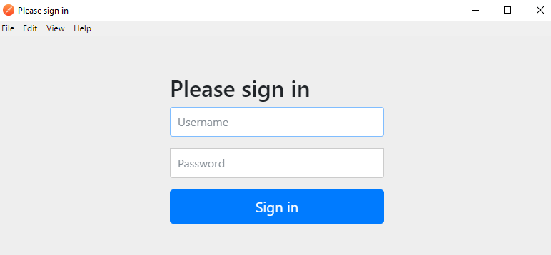

## Spring Security OAuth

### Introduction

OAuth 2 is an authorization framework that enables applications to obtain limited access to user accounts on an HTTP service, such as Facebook, GitHub. It works by delegating user authentication to the service that hosts the user account, and authorizing third-party applications to access the user account. OAuth 2 provides authorization flows for web and desktop applications, and mobile devices.

## OAuth Roles

OAuth defines four roles:

- Resource Owner
- Client
- Resource Server
- Authorization Server

### Resource Owner: *User*

The resource owner is the *user* who authorizes an *application* to access their account. The application’s access to the user’s account is limited to the “scope” of the authorization granted (e.g. read or write access).

### Resource / Authorization Server: *API*

The resource server hosts the protected user accounts, and the authorization server verifies the identity of the *user* then issues access tokens to the *application*.

From an application developer’s point of view, a service’s **API** fulfills both the resource and authorization server roles. We will refer to both of these roles combined, as the *Service* or *API* role.

### Client: *Application*

The client is the *application* that wants to access the *user*’s account. Before it may do so, it must be authorized by the user, and the authorization must be validated by the API.

## Abstract Protocol Flow

Now that you have an idea of what the OAuth roles are, let’s look at a diagram of how they generally interact with each other:


Here is a more detailed explanation of the steps in the diagram:

1. The *application* requests authorization to access service resources from the *user*
2. If the *user* authorized the request, the *application* receives an authorization grant
3. The *application* requests an access token from the *authorization server* (API) by presenting authentication of its own identity, and the authorization grant
4. If the application identity is authenticated and the authorization grant is valid, the *authorization server* (API) issues an access token to the application. Authorization is complete.
5. The *application* requests the resource from the *resource server* (API) and presents the access token for authentication
6. If the access token is valid, the *resource server* (API) serves the resource to the *application*

## Application Registration

Before using OAuth with your application, you must register your application with the service. This is done through a registration form in the “developer” or “API” portion of the service’s website, where you will provide the following information (and probably details about your application):

- Application Name
- Application Website
- Redirect URI or Callback URL

The redirect URI is where the service will redirect the user after they authorize (or deny) your application, and therefore the part of your application that will handle authorization codes or access tokens.

### Client ID and Client Secret

Once your application is registered, the service will issue “client credentials” in the form of a *client identifier* and a *client secret*. The Client ID is a publicly exposed string that is used by the service API to identify the application, and is also used to build authorization URLs that are presented to users. The Client Secret is used to authenticate the identity of the application to the service API when the application requests to access a user’s account, and must be kept private between the application and the API.

## Authorization Grant

In the *Abstract Protocol Flow* above, the first four steps cover obtaining an authorization grant and access token. The authorization grant type depends on the method used by the application to request authorization, and the grant types supported by the API. OAuth 2 defines four grant types, each of which is useful in different cases:

- **Authorization Code**: used with server-side Applications
- **Implicit**: used with Mobile Apps or Web Applications (applications that run on the user’s device)
- **Resource Owner Password Credentials**: used with trusted Applications, such as those owned by the service itself
- **Client Credentials**: used with Applications API access

## Grant Type: Authorization Code

The **authorization code** grant type is the most commonly used because it is optimized for *server-side applications*, where source code is not publicly exposed, and *Client Secret* confidentiality can be maintained. This is a redirection-based flow, which means that the application must be capable of interacting with the *user-agent* (i.e. the user’s web browser) and receiving API authorization codes that are routed through the user-agent.

Now we will describe the authorization code flow:


### Step 1: Authorization Code Link

First, the user is given an authorization code link that looks like the following:

```
http://localhost:9090/auth/oauth/authorize?response_type=code&client_id=CLIENT_ID&redirect_uri=CALLBACK_URL&scope=read
```

Here is an explanation of the link components:

- http://localhost:9090/auth/oauth/authorize: the API authorization endpoint

- **client_id=client_id**: the application’s *client ID* (how the API identifies the application)

- **redirect_uri=CALLBACK_URL**: where the service redirects the user-agent after an authorization code is granted

- **response_type=code**: specifies that your application is requesting an authorization code grant

- **scope=read**: specifies the level of access that the application is requesting

  

### Step 2: User Authorizes Application

When the user clicks the link, they must first log in to the service, to authenticate their identity (unless they are already logged in). Then they will be prompted by the service to *authorize* or *deny* the application access to their account. Here is an example authorize application prompt:



### Step 3: Application Receives Authorization Code

If the user clicks “Authorize Application”, the service redirects the user-agent to the application redirect URI, which was specified during the client registration, along with an *authorization code*. The redirect would look something like this (assuming the application is “dropletbook.com”):

```
http://localhost:9090/callback?code=AUTHORIZATION_CODE
```

### Step 4: Application Requests Access Token

The application requests an access token from the API, by passing the authorization code along with authentication details, including the *client secret*, to the API token endpoint. Here is an example POST request to token endpoint:

```
http://localhost:9090/auth/oauth/token?client_id=CLIENT_ID&client_secret=CLIENT_SECRET&grant_type=authorization_code&code=AUTHORIZATION_CODE&redirect_uri=CALLBACK_URL
```

### Step 5: Application Receives Access Token

If the authorization is valid, the API will send a response containing the access token (and optionally, a refresh token) to the application. The entire response will look something like this:

```
{"access_token":"ACCESS_TOKEN","token_type":"bearer","expires_in":2592000,"refresh_token":"REFRESH_TOKEN","scope":"read"}}
```

Now the application is authorized! It may use the token to access the user’s account via the service API, limited to the scope of access, until the token expires or is revoked. If a refresh token was issued, it may be used to request new access tokens if the original token has expired.